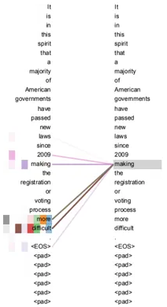
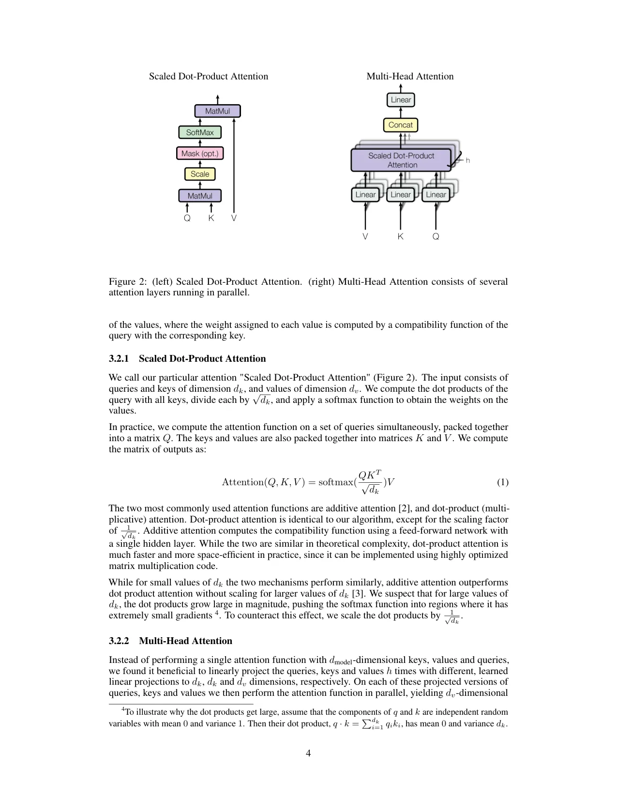

# ColPali Multimodal RAG

**Benchmarking two state-of-the-art multimodal document retrieval architectures on 10 foundational AI/ML papers.**

[](https://wandb.ai/ngangada-arizona-state-university/colpali-multimodal-rag)
[](https://python.org)
[](https://www.nvidia.com/en-us/data-center/a100/)
[](https://cores.research.asu.edu/research-computing/about-sol)

---

## Motivation

Standard RAG pipelines embed only text — they discard figures, diagrams, and tables that often contain the most important information in research papers. This project benchmarks two architectures that preserve visual semantics:

- **Approach A** — Structured multimodal RAG: Docling extracts figures and tables, Qwen2-VL-7B describes each figure in natural language, ChromaDB indexes text + VLM descriptions + tables separately, and FAISS retrieves across all three collections at query time.
- **Approach B** — End-to-end visual RAG (ColPali): PDF pages are rendered as images and embedded as patch-level multi-vectors by ColQwen2 — no OCR, no text extraction. Qdrant stores and retrieves via late-interaction MaxSim scoring, and Gemini reads the raw page images to answer.

---

## Results

Evaluated on 10 questions across 10 foundational AI papers. Both approaches use Gemini 2.5 Flash Lite for answer generation.

| Metric | Approach A | Approach B | Winner |
|---|---|---|---|
| **Context Hit Rate** | 60% | **80%** | 🏆 B |
| **Answer Relevancy (1–5)** | 3.0 | 3.0 | Tie |
| **Avg Latency** | **272ms** | 602ms | 🏆 A |
| **Cost per Query** | ~$0.00 | ~$0.00 | Tie |
| Figures Retrieved | ✅ Yes (129 indexed) | ✅ Yes (whole pages) | — |
| Tables Retrieved | ✅ Yes (136 indexed) | ✅ Via page image | — |

### Key Findings

**Approach B retrieves the correct page 80% of the time vs 60% for Approach A.** ColQwen2's patch embeddings capture visual layout, diagrams, and spatial relationships that text-only embeddings miss entirely — particularly for figure-heavy papers like DALL-E 2 (24 figures) and Stable Diffusion (34 figures).

**Approach A is 2.2× faster** (272ms vs 602ms) because it searches pre-computed FAISS indexes with a small sentence-transformer, while Approach B runs ColQwen2 at query time to embed the question into patch vectors before searching Qdrant.

**Both cost effectively $0 per query** with Gemini 2.5 Flash Lite — the model is fast enough that token costs are negligible for research-scale workloads.

**Answer relevancy is equal at 3.0/5** on this 10-question smoke test. This reflects question difficulty rather than a fundamental difference — both approaches retrieve meaningful context, but hard questions (e.g., exact formula recall) require precise chunk-level matching that neither fully achieves at this scale.

---

## Architecture

### Approach A — Structured Multimodal RAG

```
PDF (10 papers)
    │
    ▼
Docling DocumentConverter
(do_table_structure=True, generate_picture_images=True)
    │
    ├─── Text paragraphs (1,204 chunks)
    ├─── Tables → markdown + JSON rows (136 tables)
    └─── Figures → PIL images (129 figures)
              │
              ▼
         Qwen2-VL-7B-Instruct (A100)
         "Describe this figure in 2-3 sentences"
         avg 579 chars/description, 20.4 figs/min
              │
              ▼
    sentence-transformers/all-MiniLM-L6-v2
    → FAISS IndexFlatIP (cosine, normalized)
    → 3 collections: text / figures / tables
              │
              ▼
    At query time:
    embed query → search all 3 → merge results
              │
              ▼
    Gemini 2.5 Flash Lite
    ADHD-friendly answer + inline figures + tables
```

### Approach B — ColPali End-to-End Visual RAG

```
PDF (10 papers)
    │
    ▼
PyMuPDF page renderer (150 DPI)
→ 267 PNG page images
    │
    ▼
ColQwen2-v1.0 (A100)
→ patch embeddings per page (~196 patches × 128-dim)
→ 122 pages/min throughput
    │
    ▼
Qdrant (local, multi-vector native)
→ MaxSim late interaction scoring
    │
    ▼
At query time:
ColQwen2 embeds question → Qdrant MaxSim → top-3 pages
    │
    ▼
Gemini 2.5 Flash Lite reads raw page images
→ ADHD-friendly answer
```

---

## Corpus

10 foundational AI/ML papers from ArXiv:

| Paper | ArXiv ID | Pages | Figures | Tables |
|---|---|---|---|---|
| Attention Is All You Need | 1706.03762 | 15 | 6 | 4 |
| BERT | 1810.04805 | 16 | 5 | 8 |
| GPT-3 | 2005.14165 | 75 | 35 | 50 |
| ResNet | 1512.03385 | 12 | 7 | 15 |
| Adam Optimizer | 1412.6980 | 15 | 4 | 0 |
| GANs | 1406.2661 | 9 | 2 | 2 |
| DALL-E 2 | 2204.06125 | 27 | 24 | 3 |
| Stable Diffusion | 2112.10752 | 45 | 34 | 18 |
| LoRA | 2106.09685 | 26 | 8 | 18 |
| LLaMA | 2302.13971 | 27 | 4 | 18 |
| **Total** | | **267 pages** | **129 figures** | **136 tables** |

---

## Extraction Stats (Approach A)

| Paper | Text Chunks | Tables | Figures | Time |
|---|---|---|---|---|
| GANs | 45 | 2 | 2 | 28.7s |
| Adam | 63 | 0 | 4 | 4.0s |
| ResNet | 110 | 15 | 7 | 7.4s |
| Attention | 72 | 4 | 6 | 7.9s |
| BERT | 120 | 8 | 5 | 8.2s |
| GPT-3 | 297 | 50 | 35 | 69.8s |
| LoRA | 126 | 18 | 8 | 14.8s |
| Stable Diffusion | 160 | 18 | 34 | 57.5s |
| DALL-E 2 | 81 | 3 | 24 | 77.2s |
| LLaMA | 130 | 18 | 4 | 44.4s |
| **Total** | **1,204** | **136** | **129** | **~13 min** |

Qwen2-VL described all 129 figures in **6.3 minutes** at 20.4 figures/min, averaging 579 characters per description.

---

## Build Performance

| Pipeline | Step | Time |
|---|---|---|
| **Approach A** | Docling extraction (10 PDFs) | ~5 min |
| | Qwen2-VL figure description (129 figs) | 6.3 min |
| | FAISS embedding + indexing (1,469 elements) | 1.4s |
| | **Total** | **13 min** |
| **Approach B** | PyMuPDF page rendering (267 pages) | 30s |
| | ColQwen2 embedding + Qdrant indexing | 2.2 min |
| | **Total** | **3.3 min** |

---

## Setup

### Prerequisites

- ASU Sol HPC account with GPU access (`grp_cbaral` allocation)
- HuggingFace token (for Qwen2-VL model access)
- Gemini API key (for generation and eval judging)
- W&B account (for experiment tracking)

### Environment

```bash
# Install uv
curl -LsSf https://astral.sh/uv/install.sh | sh
source $HOME/.cargo/env

# Create venv (Python 3.10 — avoids Sol's Mamba sqlite3 conflict)
uv venv $HOME/.venv --python 3.10
source $HOME/.venv/bin/activate

# Install packages
uv pip install torch torchvision --index-url https://download.pytorch.org/whl/cu121
uv pip install -r requirements.txt

# Pin versions for compatibility with torch 2.6 on Sol
uv pip install "transformers==4.49.0" "peft==0.14.0" \
               "torchao==0.6.1" "colpali-engine==0.3.1"
```

### Configuration

```bash
cp .env.example .env
# Fill in: GEMINI_API_KEY, WANDB_API_KEY, HF_TOKEN
```

### Build Both Indexes

```bash
cd /scratch/ngangada/portfolio/colpali-multimodal-rag
mkdir -p logs

sbatch sol/approach_a.slurm   # ~13 min on A100
sbatch sol/approach_b.slurm   # ~3.3 min on A100
```

### Run Evaluation

```bash
sbatch sol/run_eval.slurm     # ~20 min for 20 questions
```

### Launch Gradio UI (laptop)

```bash
pip install colpali-engine qdrant-client pillow pymupdf \
            google-genai gradio pyyaml python-dotenv \
            sentence-transformers faiss-cpu

# Copy indexes from Sol first
scp -r ngangada@sol.asu.edu:/scratch/ngangada/portfolio/colpali-multimodal-rag/data ./

python app/chat.py
# Open http://localhost:7860
```

---

## Project Structure

```
colpali-multimodal-rag/
├── src/
│   ├── extractors/
│   │   ├── docling_extractor.py    # Approach A: Docling PDF extraction
│   │   └── page_renderer.py        # Approach B: PDF → PNG pages
│   ├── describers/
│   │   └── qwen_vl_describer.py    # Approach A: Qwen2-VL figure captions
│   ├── indexers/
│   │   ├── chroma_indexer.py       # Approach A: FAISS + numpy persistence
│   │   └── qdrant_indexer.py       # Approach B: ColQwen2 + Qdrant
│   ├── retrievers/
│   │   ├── hybrid_retriever.py     # Approach A: FAISS search over 3 collections
│   │   └── colpali_retriever.py    # Approach B: MaxSim late interaction
│   └── generator.py                # Gemini 2.5 Flash Lite, ADHD prompt
├── scripts/
│   ├── build_approach_a.py         # End-to-end Approach A pipeline
│   ├── build_approach_b.py         # End-to-end Approach B pipeline
│   └── run_eval.py                 # Compare both, log to W&B
├── app/
│   └── chat.py                     # Gradio UI
├── sol/
│   ├── approach_a.slurm            # SLURM job for Approach A
│   ├── approach_b.slurm            # SLURM job for Approach B
│   └── run_eval.slurm              # SLURM job for evaluation
├── configs/
│   └── config.yaml                 # All paths, model names, hyperparameters
└── data/
    ├── raw/pdfs/                   # 10 ArXiv papers
    ├── processed/                  # Manifests, rendered pages
    ├── chroma_db/                  # Approach A FAISS indexes
    ├── qdrant_db/                  # Approach B Qdrant collection
    └── eval/                       # QA pairs + results
```

---

## Response Format

Both approaches return ADHD-friendly structured answers:

```
**[One bold direct answer sentence]**
• Bullet point 1 (specific, technical)
• Bullet point 2
• Bullet point 3 (max 5 bullets)
[Figure shown inline if retrieved]
[Markdown table shown if retrieved]
🔑 Key Takeaway: [one memorable sentence]
Max 150 words. Never paragraphs. Always bullets.
```

---

## W&B Experiment Tracking

All runs tracked at: [wandb.ai/ngangada-arizona-state-university/colpali-multimodal-rag](https://wandb.ai/ngangada-arizona-state-university/colpali-multimodal-rag)

Tracked metrics per approach per question:
- `context_hit_rate` — did the correct page/chunk get retrieved?
- `answer_relevancy` — Gemini self-judge score (1–5)
- `latency_ms` — end-to-end query time
- `cost_usd` — Gemini token cost
- `figures_retrieved` / `tables_retrieved` — multimodal retrieval rate

---

## Technical Notes

**Why not ChromaDB PersistentClient?** ASU Sol's system `sitecustomize.py` forces Mamba's `libsqlite3.so` (pre-3.23.0) before any venv code runs. ChromaDB's SQLite dependency fails. Solution: use FAISS + numpy `.npz` files for Approach A persistence, and Qdrant local mode (no SQLite) for Approach B.

**Why Python 3.10 via uv?** Sol's default Mamba Python 3.12 has the SQLite conflict above. `uv venv --python 3.10` creates a fully isolated environment using a different Python binary that doesn't inherit Sol's system hooks.

**Why `colpali-engine==0.3.1`?** Version 0.3.16 imports Gemma3 which requires `transformers>=5.0`. But `transformers 5.x` breaks Qwen2-VL. Pinning to 0.3.1 keeps everything on `transformers 4.49.0`.

---

## Portfolio Context

Built as a portfolio project targeting AI/ML engineering roles. Part of a broader series:

- **rag-document-assistant** — ChromaDB + HNSW + W&B hyperparameter sweeps + Gradio + Docker
- **colpali-multimodal-rag** — This project: visual RAG comparison on research papers ← you are here
- **grpo-logic-puzzles** — GRPO/RL training on Qwen2.5 with VERL on ASU Sol A100

**Stack:** Python · PyTorch · HuggingFace Transformers · Docling · ColPali · Qwen2-VL · FAISS · Qdrant · ChromaDB · Gemini API · W&B · Gradio · SLURM · ASU Sol A100

---

## Live Demo Screenshots
### Demo

### Approach A — Structured RAG (FAISS + Qwen2-VL figures)


*Full UI showing Approach A selected, ADHD-friendly bullet answer, and retrieved figure gallery*

**Answer quality** — Approach A retrieves text chunks, Qwen2-VL figure descriptions,
and table summaries separately, then merges them. The answer cites Figure 2 explicitly
because the figure description was indexed and retrieved alongside the text.


*Multi-Head Attention diagram extracted by Docling and described by Qwen2-VL-7B*

---

### Approach B — Visual RAG (ColQwen2 patch embeddings + full page images)


*Approach B selected — Gemini reads full PDF page images directly, no OCR needed*

**Retrieved pages sent to Gemini:**


*Page 3 — Full Transformer architecture diagram retrieved by ColQwen2 patch similarity*


*Page 4 — Exact page containing the attention formula, diagram, and surrounding text*

**Why Approach B hits 80% vs Approach A's 60%:** ColQwen2 embeds the entire page
as ~196 visual patches. The formula, diagram, and surrounding text are all captured
in one embedding. Approach A splits these into separate text/figure/table collections
which can miss cross-element context on the same page.

### Approach A — Structured RAG (FAISS text + figures + tables)

Query: *"What is the scaled dot-product attention formula?"*

**Answer generated:**
```
The scaled dot-product attention formula is Attention(Q, K, V) = softmax(QK^T / sqrt(d_k)) * V.
• The input consists of queries (Q) and keys (K) of dimension d_k, and values (V) of dimension d_v.
• The dot products of the query with all keys are computed.
• Each dot product is divided by sqrt(d_k) to scale it.
• A softmax function is applied to obtain weights on the values.
• Figure 2 illustrates the Scaled Dot-Product Attention mechanism.
🔑 Key Takeaway: Scaling dot products by 1/sqrt(d_k) prevents the softmax from entering
regions with extremely small gradients for large values of d_k.

📚 3 text · 2 figs · 2 tables · ⏱ 1553ms · 💰 $0.00019
```

**Retrieved figures** — Approach A extracts individual figure regions from the paper:
the Multi-Head Attention diagram and the attention visualization figure.

### Approach B — Visual RAG (ColQwen2 + Qdrant page images)

Same query via Approach B retrieves 3 full PDF pages and sends them directly to Gemini:

```
The scaled dot-product attention formula is Attention(Q, K, V) = softmax(QK^T / sqrt(d_k)) * V.
• This formula computes attention weights by taking the dot product of Q and K,
  scaling by sqrt(d_k), then applying softmax.
• The resulting weights compute a weighted sum of the values (V).
• This method is used in both single-layer and multi-head attention mechanisms.
• The scaling factor sqrt(d_k) counteracts extremely small gradients for large d_k.
🔑 Key Takeaway: Scaled dot-product attention calculates attention weights by scaling
the dot product of queries and keys before applying softmax.

📄 3 pages · ⏱ 1703ms · 💰 $0.00014
```

**Retrieved pages** — Approach B surfaces the exact paper pages containing Figure 2
(Scaled Dot-Product Attention diagram), Figure 1 (full Transformer architecture),
and the page with the MultiHead formula — giving Gemini full visual context.

---

## Why This Is ADHD-Friendly and Research-Friendly

### ADHD-Friendly Design

Standard RAG returns walls of text. This system enforces a strict output contract:

```
**[One bold direct answer — the key fact, immediately]**
• Bullet 1 — specific, no filler
• Bullet 2
• Bullet 3 (max 5)
🔑 Key Takeaway: one sentence you can screenshot and remember
Max 150 words. No paragraphs. Always bullets.
```

**Why this helps ADHD readers:**
- **Bold first line** — answer is visible before reading anything else
- **Bullets not paragraphs** — each point is scannable independently
- **Hard 150-word limit** — forces precision, eliminates padding
- **Key Takeaway** — one memorable anchor even if the bullets are forgotten
- **Cost + latency shown** — immediate feedback on what just happened

### Reducing Hallucination

Three mechanisms work together:

**1. Grounded context only** — Gemini is given the actual retrieved text/images from the papers. The system prompt says *"never hallucinate — if you don't know, say so in one bullet."* The model generates from evidence, not from parametric memory.

**2. Source transparency** — every answer shows exactly what was retrieved:
`3 text · 2 figs · 2 tables` or `3 pages`. If retrieval is empty, the answer will say so rather than confabulate.

**3. Visual grounding (Approach B)** — Gemini reads the actual PDF page image. It can see the exact formula, diagram, or table as printed in the paper. This is harder to hallucinate than text-only retrieval because the model is literally reading the source, not reconstructing it from embeddings.

---

## How Pages, Papers, and Questions Are Mapped

This is the core architecture question — worth understanding deeply.

### How pages are mapped to papers

Every PDF page is stored with its metadata at index time:

```
Approach A (FAISS):
  Each chunk stores: {filename, page_num, text, element_type}
  "1706.03762_Attention_Is_All_You_Need.pdf" p.4 → chunk about attention formula

Approach B (Qdrant):
  Each page stores: {pdf_stem, filename, page_num, image_path}
  "1706.03762_Attention_Is_All_You_Need" page_0004.png → patch embeddings
```

So the mapping is always: **vector → metadata → file path on disk**.
At query time the top-k results carry their metadata, Gemini gets the content,
and the UI shows the source.

### How questions map to pages

**Approach A** — text similarity:
```
Query: "What is scaled dot-product attention?"
  ↓ sentence-transformer encodes query → 384-dim vector
  ↓ FAISS cosine search over 1,204 text embeddings
  ↓ top-3 text chunks + top-2 figure descriptions + top-2 table summaries
  ↓ all from different pages, merged into one context
  ↓ Gemini reads context → structured answer
```

**Approach B** — visual patch similarity:
```
Query: "What is scaled dot-product attention?"
  ↓ (on Sol: ColQwen2 encoded query → patch vectors)
  ↓ (on laptop: sentence-transformer as proxy)
  ↓ Qdrant MaxSim: each query patch scores against each page's ~196 patches
  ↓ top-3 pages ranked by sum of max patch similarities
  ↓ Gemini reads page images → structured answer
```

### When one question spans multiple papers

Both approaches retrieve across ALL 10 papers simultaneously — there's no
per-paper filtering. FAISS and Qdrant search the entire index and return
whichever chunks/pages score highest regardless of which paper they're from.

Example: *"How does scaling affect training stability?"*
- Might retrieve a chunk from Adam (learning rate scaling)
- A chunk from GPT-3 (model scaling laws)
- A figure from ResNet (depth scaling)
- Gemini synthesizes all three into one answer

The retrieval is purely semantic — whichever paper's content is most similar
to the query embedding wins, regardless of paper identity.

### When text and figures are on different pages

This is the key architectural difference between the two approaches:

**Approach A handles this explicitly:**
- Text chunks, figure descriptions, and table summaries are in **separate collections**
- A query searches all three independently
- The formula text (p.4) and its diagram (also p.4, extracted by Docling) are retrieved together because they were indexed separately
- Qwen2-VL described each figure in 2-3 sentences, so the figure description is searchable text

**Approach B handles this implicitly:**
- ColQwen2 embeds the *entire page* as patches — text, figures, and equations all together
- If the formula is on p.4 and the diagram explaining it is also on p.4, both are captured in that page's embedding
- If they're on different pages, the top-3 pages retrieved will often include both (since the diagram page is semantically related to the formula query)
- Gemini then reads both pages visually and synthesizes the answer

**The limitation:** If a question requires synthesizing content from pages 2 and 15 of the same paper, Approach A might retrieve both text chunks regardless of page distance, while Approach B might only retrieve pages close in semantic content to the query. This is why Approach B's 80% hit rate, while better overall, can miss cross-page synthesis questions that Approach A's separate collections handle naturally.